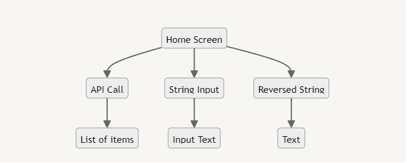
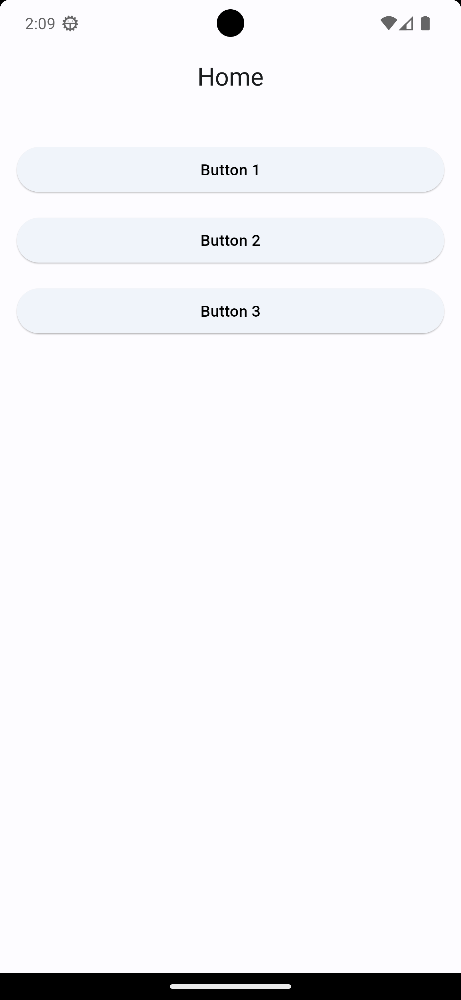
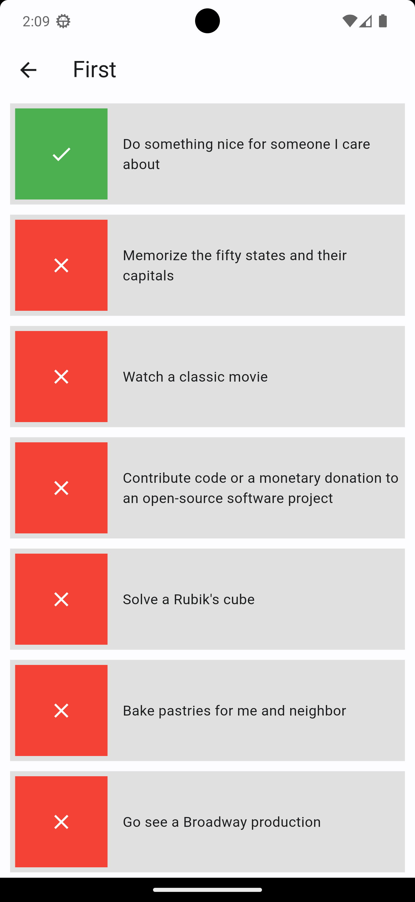
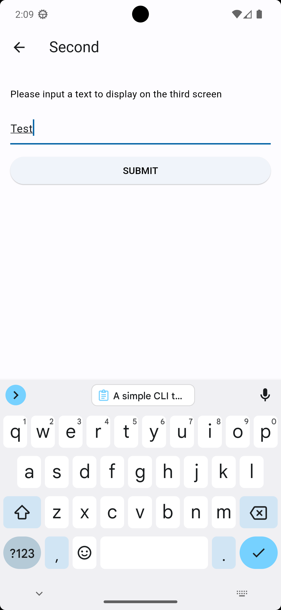
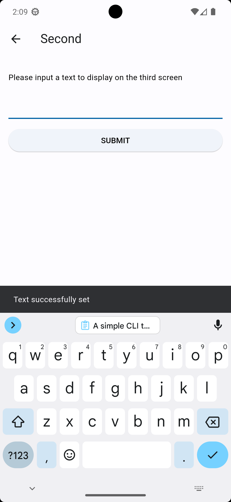
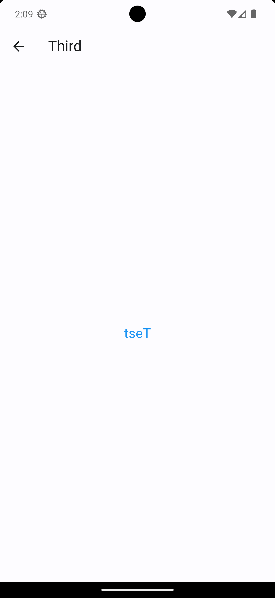

# Introduction

A simple project that showcases feature-first MVVM architecture without third party state management libraries.

# Development

This project is made using Flutter as a test project last September 2023. It showcases the use of feature-first MVVM architecture with no BLoC, Riverpod, Provider or other third party state management libraries.

## Problem
1. **Project Setup:**

    Create a new Flutter project.

2. **App Development:**
    
    Create an app with the following specifications:
    
    1. **Home Screen:**
        - Create Home Screen with three buttons, each navigating to a different screen:
            1. Button 1: Perform an API call.
            2. Button 2: Accept user input as a string.
            3. Button 3: Display the reversed version of the string from Screen 2.
    2. **Screen 1:**
        - Implement Screen 1, which is triggered by Button 1 from Home Screen.
        - Use the provided API endpoint [**`https://dummyjson.com/todos`**](https://dummyjson.com/todos) to fetch a list of todo items.
        - Display the fetched todo items in a list on this screen.
    3. **Screen 2:**
        - Implement Screen 2, which is triggered by Button 2 from Home Screen.
        - This screen accepts a text input.
    4. **Screen 3:**
        - Implement Screen 3, which is triggered by Button 3 from Home Screen.
        - This screen should display the text input from Screen 2 in reverse.
    
    

3. **Testing:**

    Write unit tests or widget tests for critical parts of your application.

## Packages Used
```
http: ^1.1.0
shared_preferences: ^2.2.1
logger: ^2.0.2
```

This project also uses [FVM - Flutter Version Management](https://fvm.app/) - a simple CLI to manage Flutter SDK versions.

# Screenshots

    
